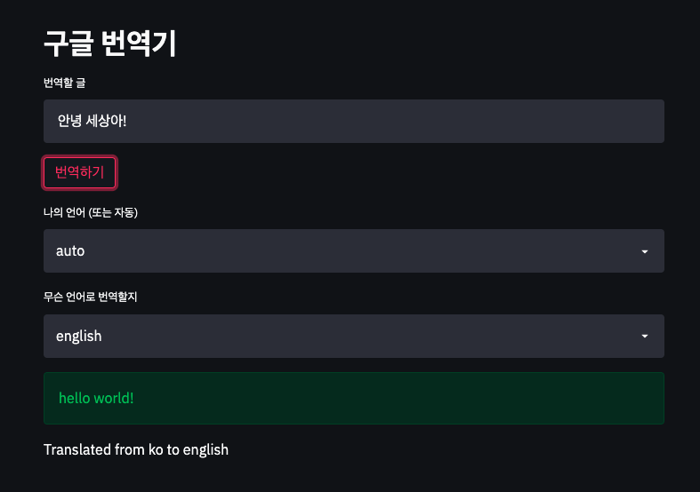

# Streamlit-translator 사용부터 배포까지

## Introduction
Streamlit은 머신러닝 서비스를 빠르게 구현할 수 있도록 도와주는 파이썬 기반의 웹어플리케이션 툴입니다.

## How to use
* 간단한 샘플

## What is Ainize
Ainize는 커먼컴퓨터(Comon Computer)에서 제공하는 서비스로 Dockerfile과 github 주소만으로 무료로 서비스를 배포할 수 있습니다. 일일히 clone해오지 않아도 만들어진 샘플 및 모델들을 시연해 볼 수 있습니다.

## Reference
https://www.seokdev.site/252
